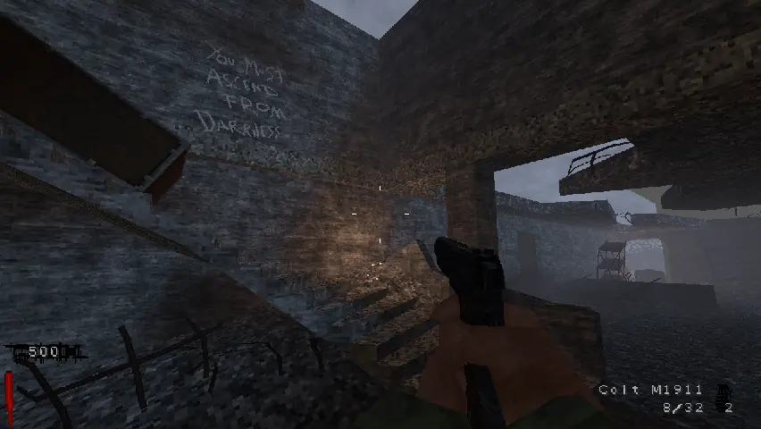
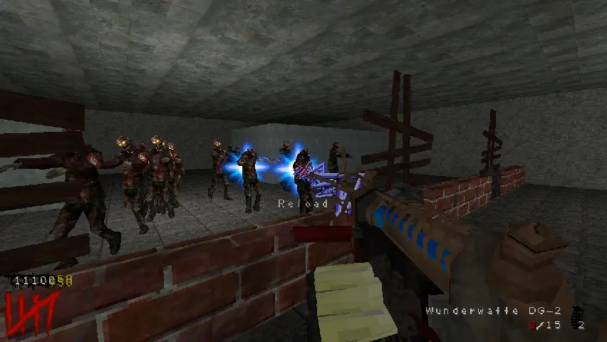
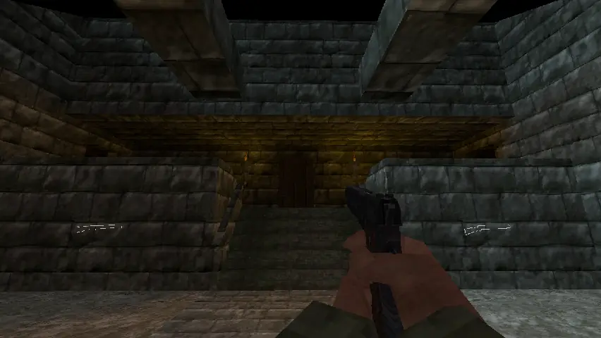
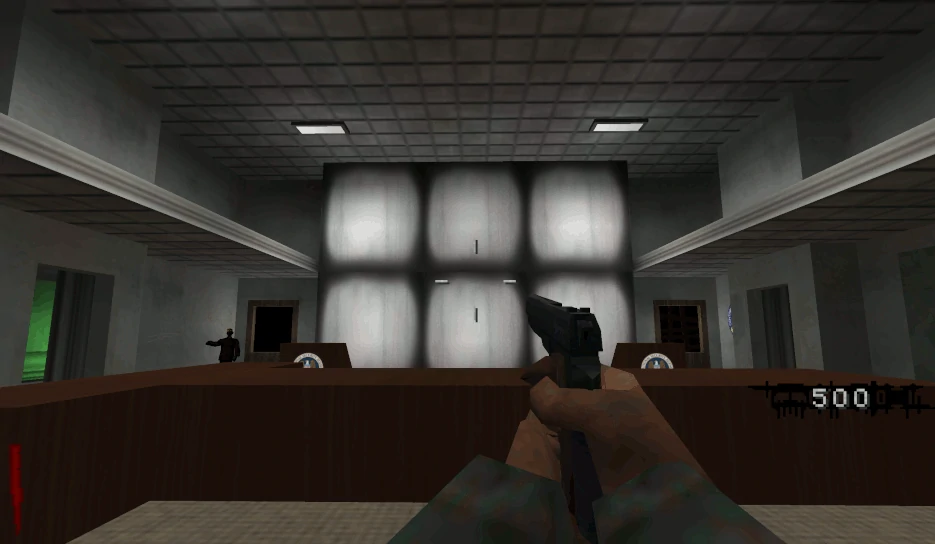
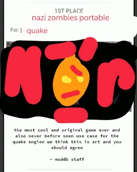

# Nazi Zombies: Portable

# About
This is the main/hub repository for NZ:P, the Call of Duty: Zombies de-make powered by various enhanced forks of the Quake engine, and has been in development since 2009. The main purpose of this hub repository is to serve as a place to host nightly builds as well as a means of bug reporting on a game-wide (non-component) scale.

The game itself is *mostly* feature-equivalent with Call of Duty: World at War on a generic level. Gameplay components are implemented, with some parity differences, but most World at War maps and their gimmicks are not yet represented. Various small features from Call of Duty: Black Ops are present, but not on as wide of a scale as compared to World at War.

Oh yeah, we have lots of bugs, too.

# GitHub Organzation Breakdown
* [assets](https://github.com/nzp-team/assets): Game GFX, Sound, etc. data.
* [dquakeplus](https://github.com/nzp-team/dquakeplus): The NZ:P PSP engine, forked from dQuakePlus.
* [fteqw](https://github.com/nzp-team/fteqw): Spike's FTEQW, with minimal changes.
* [quakespasm](https://github.com/nzp-team/quakespasm): The NZ:P Nintendo Switch and PS VITA engine, forked from QuakespasmNX.
* [quakec](https://github.com/nzp-team/quakec): The game-side code for things like weapons and Perk machines.
* [tools](https://github.com/nzp-team/tools): Misc. development tools.

# Screenshots

    

        
         
    

    

        
         
    

    

# Credits
* Blubswillrule: Coding, Models, GFX, Sounds, Music
* Ju\[s]tice: Maps, Models, GFX
* Jukki: Coding
* Biodude: Sounds
* Dr_Mabuse1981: Coding
* Naievil: Coding, NX Port
* MotoLegacy: Coding, GFX, Music
* Derped_Crusader: Models, GFX
* Rinnegatamante: VITA Port

Special Thanks:
* Spike: FTEQW
* Shpuld: Clean-CSQC
* Crow_Bar: dQuake
* st1x51: dQuakePlus
* fgsfdsfgs: QuakespasmNX
* Azenn: GFX help
* Marty P.: Music help
* BCDeshiG: Heavy bug testing
* The many Quakespasm contributors: well, erm, Quakespasm.