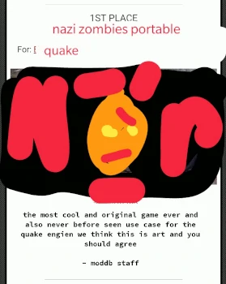
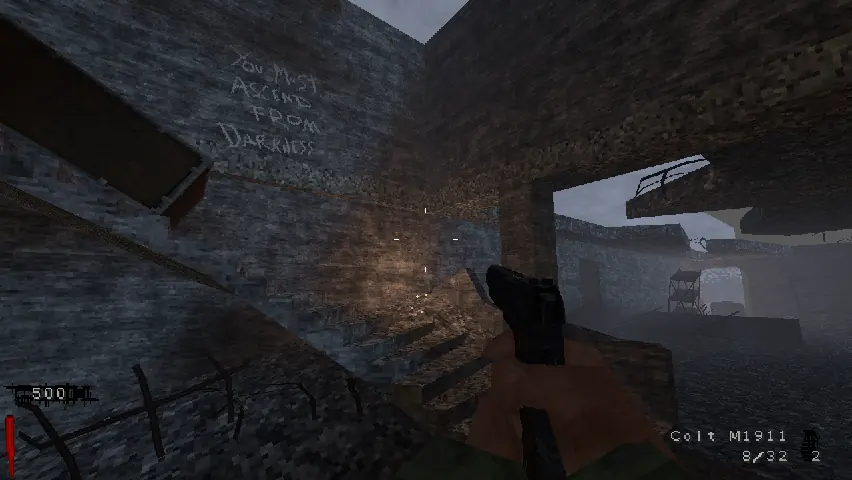
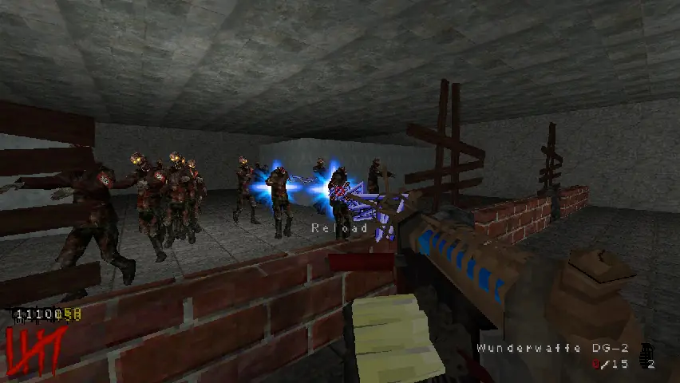
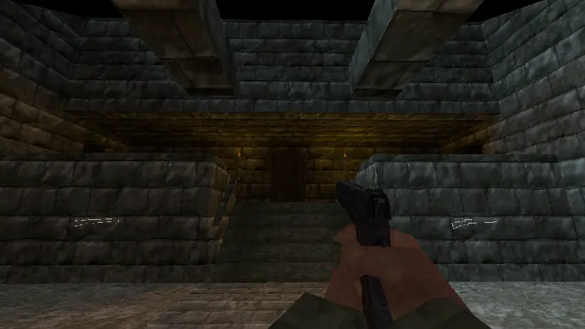

# Nazi Zombies: Portable

# About
This is the main/hub repository for NZ:P, a Call of Duty: Zombies "de-make" powered by various enhanced forks of the Quake engine, in development since 2009. This hub repository serves as a place to host nightly builds as well as a means of bug reporting on a game-wide (non-component) scale. See [the breakdown](#github-organization-breakdown) for source code and other components.

The game itself is feature-equivalent with Call of Duty: World at War on a generic level. Gameplay components are implemented with minor parity differences. Most World at War maps and their unique features are not yet represented. Various small additions and changes from Call of Duty: Black Ops are present as a means of gameplay smoothing, but not on a wide scale. NZ:P is, first and foremost, a Call of Duty: World at War remake.

# Supported Platforms
* Linux (x86, x86_64, armhf, arm64)
* Nintendo Switch
* Nintendo 3DS
* PlayStation Portable (both "PHAT" (PSP-1000) and "SLIM" (PSP-2000 and higher))
* PlayStation VITA
* [WebGL](https://nzp.gay)
* Windows (x86, x86_64)
* TI NSPIRE (CX II)

# GitHub Organization Breakdown
* [assets](https://github.com/nzp-team/assets): Game GFX, Sound, etc. data.
* [vril-engine](https://github.com/nzp-team/vril-engine): The NZ:P engine.
* [quakec](https://github.com/nzp-team/quakec): The game-side code for things like weapons and Perk machines.
* [tools](https://github.com/nzp-team/tools): Misc. development tools.
* [toolbox](https://github.com/nzp-team/toolbox): AiO Development suite for map makers and contributors.

# Screenshots

    

        
         
    

    

        
         
    

# Credits

#### Programming
Blubswillrule, Jukki, DR_Mabuse1981, Naievil, Cypress, Scatterbox

#### Models
Blubswillrule, Ju\[s]tice, Derped_Crusader

#### GFX
Blubswillrule, Ju\[s]tice, Cypress, Derped_Crusader

#### Sounds/Music
Blubswillrule, Biodude, Cypress, Marty P.

#### Special Thanks
* Spike, Eukara, Contributors: FTEQW
* Shpuld: CleanQC4FTE, heavy dQuakePlus optimization
* Crow_Bar, st1x51: (a)dQuake(plus)
* fgsfdsfgs: Quakespasm-NX
* MasterFeizz: ctrQuake
* Rinnegatamante: Initial VITA port, VITA Auto-Updater
* Ralf Willenbacher: nQuake
* Azenn: GFX Assistance
* BCDeshiG: Extensive Testing

# Stars
<a href="https://www.star-history.com/?repos=nzp-team%2Fnzportable%2Cnzp-team%2Fvril-engine%2Cnzp-team%2Fquakec%2Cnzp-team%2Fassets%2Cnzp-team%2Fnzp-team.github.io&type=date&legend=top-left">
 <picture>
   <source media="(prefers-color-scheme: dark)" srcset="https://api.star-history.com/image?repos=nzp-team/nzportable%2Cnzp-team/vril-engine%2Cnzp-team/quakec%2Cnzp-team/assets%2Cnzp-team/nzp-team.github.io&type=date&theme=dark&legend=top-left" />
   <source media="(prefers-color-scheme: light)" srcset="https://api.star-history.com/image?repos=nzp-team/nzportable%2Cnzp-team/vril-engine%2Cnzp-team/quakec%2Cnzp-team/assets%2Cnzp-team/nzp-team.github.io&type=date&legend=top-left" />
   
 </picture>
</a>
